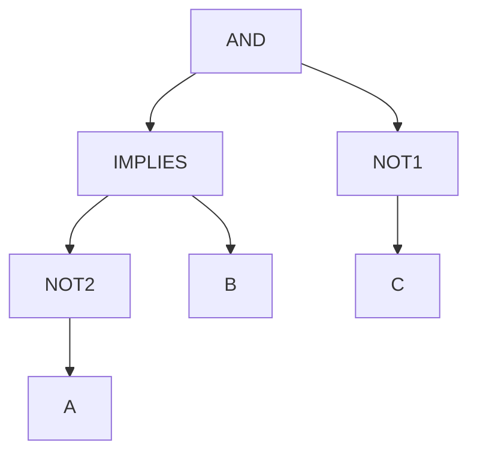

## Symbole für Aussagen

### Zweistellige Operatoren

#### Und $\wedge$
Wenn beides (/alles) richtig ist ...

#### Oder $\lor$
Wenn mindestens eines richtig ist ...

#### Implikation $\Rightarrow$
Ist nur falsch wenn A wahr ist und B falsch sonst richtig

In Zahlen ausgedrückt muss also die rechte Seite mindestens gleich oder mehr sein als links. Oder anders gesagt wenn links richtig ist dann muss es rechts auch richtig sein.

> [!example]+ Wahrheitstabelle
>
>
> | $A$ | $B$ | $A \Rightarrow B$          |
> | --- | --- | -------------------------- |
> | 0   | 0   | 1                          |
> | 0   | 1   | 1                          |
> | 1   | 0   | 0 (Einziger falscher Fall) |
> | 1   | 1   | 1                          |

Wird beim [[3-korrekte-argumentation|Argumentieren respektive beweisen]] gebraucht weil eine Schlange aus Implikationen immer Wahr sein muss wenn nur die erste Instanz wahr war.

#### Logische Äquivalenz $\Leftrightarrow$
Wenn die beiden werte gleich sind, unabhängig davon ob sie wahr oder falsch sind ...

> [!example]+ Wahrheitstabelle
> | $A$ | $B$ | $A \Leftrightarrow B$ |
> | --- | --- | --------------------- |
> | 0   | 0   | 1                     |
> | 0   | 1   | 0                     |
> | 1   | 0   | 0                     |
> | 1   | 1   | 1                     |

### Einstellige Operatoren
#### Negation $\neg$
Kehrt den Wert um also von wahr zu falsch und von falsch zu wahr. Geht vor, respektive wird als erstes evaluiert

> [!example]+ Wahrheitstabelle
> | $A$ | $\neg A$ |
> | --- | -------- |
> | 1   | 0        |
> | 0   | 1        |

## Weitere Begriffe
### Logische Formel
Etwas wie das hier $(\neg A \lor B) \land C$ nennen wir **logische Formel**.
### Belegungen
Weisen wir jeder Variabel einer [[#Logische Formel|logischen Formel]] einen Wert zu nennt man das eine **Belegung**. Führt diese dazu dass die logischer Formel wahr wird nennen wir sie **erfüllende Belegung** (oder natürlich andersherum **nicht erfüllende Belegung**)
Bei grossen logischen Formeln kann es je nachdem sehr lange gehen herauszufinden ob sie eine erfüllende Belegung haben ([Erfüllbarkeitsproblem](https://de.wikipedia.org/wiki/Erf%C3%BCllbarkeitsproblem_der_Aussagenlogik)).
## Syntaxbaum
Einen Syntaxbaum kann man nutzen um auf visuelle Art und Weise eine [[#Logische Formel|logische Formel]] darzustellen. Es kann auch helfen verschiedene Belegungen zu prüfen.

### Tautologie
Wenn eine [[#Logische Formel|logische Formel]] für alle Belegungen stets den Wahrheitswert 1 hat, dann nennt man diese Formel Tautologie: zb. $A \implies (A ∨ B)$ oder $(A ⇒ B) ⇔ (¬B ⇒ ¬A)$ (diese zweite logische Formel wird noch eine Rolle spielen bei der [[3-korrekte-argumentation|korrekten Argumentation]])
### Kontradiktion
Wenn eine [[#Logische Formel|logische Formel]] für alle Belegungen stets den Wahrheitswert 0 hat, dann nennt man diese Formel Kontradiktion: zb. $A ∧ ¬A$ (gesprochen: A und nicht A)
### Semantische Äquivalenz
Zwei logische Formeln heissen semantisch äquivalent, falls sie dieselbe Wahrheitstafel haben. d.h. wenn sie für alle Belegungen stets den selben Wahrheitsgehalt haben.
Notation: $f \equiv g$
Aus dem Beispiel $A \Rightarrow B \equiv \neg A \lor B$ lernen wir auch dass man die [[#Implikation]] aus einer [[#Negation $ neg$|Negation]] und dem [[#Oder $ lor$|Oder]] zusammenbauen kann.

| $A$ | $B$ | $A \Rightarrow B$ | $\neg A \lor B$ |
| --- | --- | ----------------- | --------------- |
| 0   | 0   | 1                 | 1               |
| 0   | 1   | 1                 | 1               |
| 1   | 0   | 0                 | 0               |
| 1   | 1   | 1                 | 1               |
### Rechenregeln

| Name                                                 | $\lor$                                                  | $\land$                                                  |
| ---------------------------------------------------- | ------------------------------------------------------- | -------------------------------------------------------- |
| Assoziativgesetze                                    | $(f \lor g) \lor h \equiv f \lor g \lor h$              | $(f \land g) \land h \equiv f \land g \land h$           |
| Kommutativgesetze                                    | $f \lor g \equiv g \lor f$                              | $f \land g \equiv g \land f$                             |
| Distributivgesetze (dasselbe wie bei der algebra) | $f \lor (g \land h) \equiv (f \lor g) \land (f \lor h)$ | $f \land (g \lor h) \equiv (f \land g) \lor (f \land h)$ |
| Absorbtionsgesetze                                   | $f \lor (f \land g) \equiv f$                           | $f \land (f \lor g) \equiv f$                            |
| Identitätsgesetze                                    | $f \lor 0 \equiv f$ $f \lor 1 \equiv 1$              | $f \land 0 \equiv 0$ $f \land 1 \equiv f$             |
| Idempotenzgesetze                                    | $f \lor f \equiv f$                                     | $f \land f \equiv f$                                     |
| Negationgesetze                                      | $f \lor \neg f \equiv 1$ $\neg\neg f \equiv f$       | $f \land \neg f  \equiv 0$                               |
| De Morgansche Gesetze                                | $\neg(f \lor g) \equiv \neg f \land \neg g$             | $\neg(f \land g) \equiv \neg f \lor \neg g$              |
Damit können wir logische Formeln vereinfachen: zb.
1. $f = (A \lor \neg B) \land (A \lor B)$ -> Distributivgesetz anwenden
2. $A \lor (B \land B)$ -> Negationsgesetz
3. $A \lor 0$ -> Identitätsgesetz
4. $A$
## Normalformen
Normalformen bringen logische Formeln in eine einheitliche Strukturen, welche es einfach machen eine logische Formel zu analysieren.
Aus Übersichtlichkeitsgründen schreiben wir für die Negation $\neg A$ lieber $\bar{A}$.
### Konjunktive Normalform
Und-Verknüpfungen aus Oder-Verknüpfungen welcher wiederum aus Variablen und negierte Variablen bestehen.

$f = f_1 \land f_2 \land ... \land f_m$
$f_i = (l_1 \lor l_2 ... \lor f_{i,n})$

die $f$'s nennt man *Klauseln* und die $l$'s *Literale*.

zb. $(A \lor \bar{B}) \land (A \lor \bar{C} \land (D) \land (C \lor \bar{D} \lor \bar{E}))$

Wie finden wir nun aber anhand der Wahrheitstabelle einer Formel $f$ die KNF?
Wir schauen uns zunächst den Fall an, wo es nur eine nicht erfüllende Belegung gibt.

| $A$ | $B$ | $C$ | $f$ |
| --- | --- | --- | --- |
| 0   | 0   | 0   | 1   |
| 0   | 0   | 1   | 1   |
| 0   | 1   | 0   | 1   |
| 0   | 1   | 1   | 1   |
| 1   | 0   | 0   | 1   |
| 1   | 0   | 1   | 0   |
| 1   | 1   | 0   | 1   |
| 1   | 1   | 1   | 1   |
Hier gibt es nur einen falschen Fall aus dem wir folgende **Klausel** bilden: $\bar{A} \lor B \lor \bar{C}$
Das ist dann gleich auch die KNF für diese Formel.

Interessant wird es aber wenn es mehrere Nullen gibt.

| $A$ | $B$ | $C$ | $f$ |
| --- | --- | --- | --- |
| 0   | 0   | 0   | 1   |
| 0   | 0   | 1   | 0   |
| 0   | 1   | 0   | 1   |
| 0   | 1   | 1   | 1   |
| 1   | 0   | 0   | 1   |
| 1   | 0   | 1   | 0   |
| 1   | 1   | 0   | 1   |
| 1   | 1   | 1   | 1   |
Hier verbinden wir diese beiden Fälle mit einer Konjunktion: $(\bar{A} \lor B \lor \bar{C}) \land (A \lor B \lor \bar{C})$ wenn eine der Klauseln nicht 1 ergeben würde würde das ganze 0 ergeben durch das und.
### Disjunktive Normalform
Die DNF ist gewissermassen das Gegenteil von der KNF.
Was vorher Klauseln waren sind nun die **Minterme**.
zb. $(A \land \bar{B}) \lor (C \land D)$
Um die DNF zu bilden schauen wir alle erfüllenden Belegungen an und bilden analog zu dem KNF (negation zur Wahrheit) die Klauseln.

### Konjunktive- und Disjunktive Normalform zusammengefasst
KNF bestimmen:
* Zeilen mit 0 anschauen
* Eingänge mit 1 negieren
* und mit $\lor$ verknüpfen pro Zeile
* resultierende Klauseln mit $\land$ verknüpfen.
DNF bestimmen:
* Zeilen mit 1 anschauen
* Eingänge mit 0 negieren
* und mit $\land$ verknüpfen pro Zeile
* resultierende Minterme mit $\lor$ verknüpfen