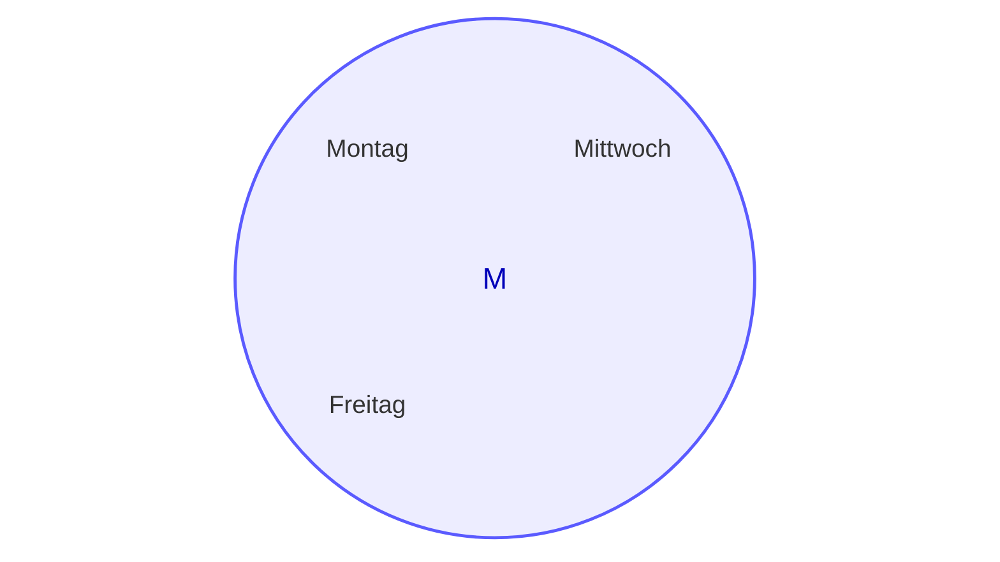

## Definition

Eine Menge ist eine Liste aus **verschiedenen** (keine Duplikate) Objekten.

$x \in M$ bedeutet $x$ ist ein Element in $M$
$x \notin M$ bedeutet $x$ ist kein Element in $M$

Wir spezifizieren eine Menge entweder in dem wir alle element kommagetrennt auflisten oder die Eigenschaften der Element der Menge spezifizieren.

zb: $M = \{x | x$ ist ein Wochentag, der den Buchstaben s nicht enthält $\}$ ist eine Menge mit den Elementen Montag, Mittwoch und Freitag.

Für die Darstellung von Mengen sind auch die sogenannten [Venn Diagramme](https://en.wikipedia.org/wiki/Venn_diagram) nützlich.

## Wichtige Mengen
$\emptyset = \{\}$ ist die leere Menge
$\mathbb{}$$\mathbb{N} = \{1, 2, 3, 4, ...\}$ ist die Menge der natürliche Zahlen
$\mathbb{N}_0 = \{0, 1, 2, 3, 4, 5 ...\}$ ist die Menge der natürlichen Zahlen mit 0
$\mathbb{Z} = \{..., -2, -1, 0, 1, 2, 3, ...\}$ ist die Menge der ganzen Zahlen.
$\mathbb{Q} = \{\frac{p}{q}|p,q \in \mathbb{Z} \land q \neq 0\}$ ist die Menge der rationalen Zahlen.
$\mathbb{R} = \{x|x$ ist reelle Zahl $\}$ ist die Menge der reellen Zahlen (zb. $\sqrt{2}$ oder $\pi$).
$\mathbb{I} = \{x|x$ ist reelle Zahl, aber keine rationale Zahl $\}$ ist die Menge der irrationalen Zahlen (also $\mathbb{R}$ ohne $\mathbb{Q}$)

siehe auch: [[koma/formelblatt|Formelblatt: Koma]]

> [!WARNING]- Manchmal ist in der Literatur $0 \in \mathbb{N}$
> Für unsere Zwecke ist es **aber** nicht teil von $\mathbb{N}$ und muss explizit erwähnt werden falls dies gewünscht ist ($\mathbb{N}_0$)
## Definition: Teilmenge ($\subseteq$ und $\supseteq$)
Es seien $A,B$ Mengen.
Wir sagen dass $A$ eine *Teilmenge* von $B$ ist bzw. dass $B$ eine *Obermenge* von $A$ ist. Dies ist der Fall wenn Jedes Element aus $A$ auch in $B$ vorhanden ist: $\forall x \in A: x \in B$
Dann schreiben wir $A \subseteq B$ ($A$ ist Teilmenge von $B$) oder $B \supseteq A$ ($B$ ist Obermenge von $A$)

> [!warning]- Manchmal kommt nur ein $\subset$/$\supset$ ohne strich vor
> Auch hier ist sich die Literatur nicht einig wir verwenden aber die mit den Strichen darunter: $\subseteq$/$\supseteq$

Null menge

## Mengenoperationen
Es seien $A,B$ Mengen.
1. $A \cup B$ ist eine Menge. Bezeichnung: Vereinigung von $A$ und $B$
   Diese Menge enthält alle Elemente die in $A$ oder in $B$ enthalten sind, also $A \cup B = \{x|x \in A \lor x \in B\}$
2. $A \cap B$ ist eine Menge. Bezeichnung: Durchschnitt von $A$ und $B$
   Diese Menge enthält alle Elemente, die in $A$ und $B$ enthalten sind, also $A \cap B = \{x|x \in A \land x \in B\}$
3. $A \textbackslash B$ ist eine Menge

## Potenzmenge

## Prinzip der Inklusion-Exklusion
Es sei: Eine Gruppe von Menschen von unbekannter Grösse. Nun fragen wir uns **Wie viele dieser Personen sprechen Englisch oder Französisch**. Jetzt würde man denken wir können einfach alle die Englisch sprechen und alle die Französisch sprechen zählen und summieren. Wenn es aber Überschneidungen gibt, also jemand beides Spricht, dann würden wir diese Person zwei mal Zählen.

