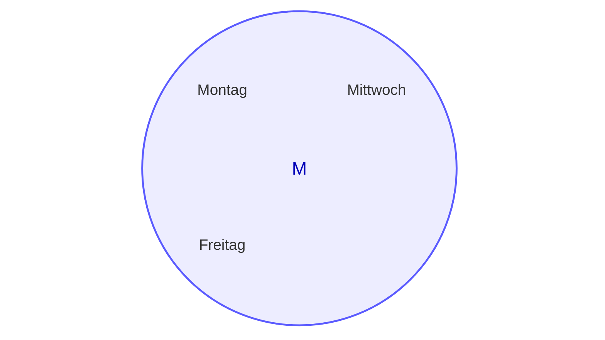

## Definition

Eine Menge ist eine Liste aus **verschiedenen** (keine Duplikate) Objekten.

$x \in M$ bedeutet $x$ ist ein Element in $M$
$x \notin M$ bedeutet $x$ ist kein Element in $M$

Wir spezifizieren eine Menge entweder in dem wir alle element kommagetrennt auflisten oder die Eigenschaften der Element der Menge spezifizieren.

zb: $M = \{x | x$ ist ein Wochentag, der den Buchstaben s nicht enthält $\}$ ist eine Menge mit den Elementen Montag, Mittwoch und Freitag.

Für die Darstellung von Mengen sind auch die sogenannten [Venn Diagramme](https://en.wikipedia.org/wiki/Venn_diagram) nützlich.

## Wichtige Mengen
$\emptyset = \{\}$ ist die leere Menge
$\mathbb{}$$\mathbb{N} = \{1, 2, 3, 4, ...\}$ ist die Menge der natürliche Zahlen
$\mathbb{N}_0 = \{0, 1, 2, 3, 4, 5 ...\}$ ist die Menge der natürlichen Zahlen mit 0
$\mathbb{Z} = \{..., -2, -1, 0, 1, 2, 3, ...\}$ ist die Menge der ganzen Zahlen.
$\mathbb{Q} = \{\frac{p}{q}|p,q \in \mathbb{Z} \land q \neq 0\}$ ist die Menge der rationalen Zahlen.
$\mathbb{R} = \{x|x$ ist reelle Zahl $\}$ ist die Menge der reellen Zahlen (zb. $\sqrt{2}$ oder $\pi$).
$\mathbb{I} = \{x|x$ ist reelle Zahl, aber keine rationale Zahl $\}$ ist die Menge der irrationalen Zahlen (also $\mathbb{R}$ ohne $\mathbb{Q}$)

siehe auch: [[koma/formelblatt|Formelblatt: Koma]]

> [!WARNING]- Manchmal ist in der Literatur $0 \in \mathbb{N}$
> Für unsere Zwecke ist es **aber** nicht teil von $\mathbb{N}$ und muss explizit erwähnt werden falls dies gewünscht ist ($\mathbb{N}_0$)
## Definition: Teilmenge ($\subseteq$ und $\supseteq$)
Es seien $A,B$ Mengen.
Wir sagen dass $A$ eine *Teilmenge* von $B$ ist bzw. dass $B$ eine *Obermenge* von $A$ ist. Dies ist der Fall wenn Jedes Element aus $A$ auch in $B$ vorhanden ist: $\forall x \in A: x \in B$
Dann schreiben wir $A \subseteq B$ ($A$ ist Teilmenge von $B$) oder $B \supseteq A$ ($B$ ist Obermenge von $A$)
![[4-mengen_teilmenge]]
Wie man sieht alle Wochentage wären in B und wir haben noch unsere Sub-Liste welche Montag, Mittwoch und Freitag beinhaltet.

> [!warning]- Manchmal kommt nur ein $\subset$/$\supset$ ohne strich vor
> Auch hier ist sich die Literatur nicht einig wir verwenden aber die mit den Strichen darunter: $\subseteq$ und $\supseteq$
>

Die Mengen sind gleich wenn $(A \subseteq B) \land (B \subseteq A)$ gesprochen: $A$ ist eine Teilmenge von $B$ und $B$ ist eine Teilmenge von $A$. (Teilmenge ist auch gegeben wenn es kongruent ist)

> [!example]+ Beispiel
> 1. $\{$Rom, Bern, Paris$\}$ $\subseteq$ $\{x|x$ ist eine Hauptstadt$\}$ (Diese Drei Städte kommen in der Liste aus Hauptstädten vor, auch wenn es noch viel mehr Hauptstädte gibt)
> 2. $\{$Rom, Bern, Paris$\}$ =  $\{$Rom, Paris, Bern$\}$ (Reihenfolge spielt keine Rolle)
> 3. $\{$Rom, Bern, Paris$\}$ $\neq$ $\{x|x$ ist eine Hauptstadt$\}$ (Diese drei Städte sind nicht auch gleichzeitig die Liste der Hauptstädte)

Für jede Menge $M$ gilt $\emptyset \subseteq M$ und $M \subseteq M$
## Mengenoperationen
Es seien $A,B$ Mengen.
1. $A \cup B$ ist eine Menge. Bezeichnung: Vereinigung von $A$ und $B$
   Diese Menge enthält alle Elemente die in $A$ **oder** in $B$ enthalten sind, also $A \cup B = \{x|x \in A \lor x \in B\}$
   ![[4-mengen_vereinigung]] ^vereinigung
2. $A \cap B$ ist eine Menge. Bezeichnung: Durchschnitt von $A$ und $B$
   Diese Menge enthält alle Elemente, die in $A$ und $B$ enthalten sind, also $A \cap B = \{x|x \in A \land x \in B\}$
   ![[4-mengen_schnitt]]^durchschnitt
3. $A \textbackslash B$ ist eine Menge. Bezeichnung: Differenz von $A$ und $B$. gesprochen: $A$ ohne $B$.
   Es ist $A \setminus B = A \cap B^c$
   ![[4-mengen_differenz]]^differenz
4. $A^c$ ist eine Menge. Bezeichnung: Komplement von $A$.
   $A^c$ enthält alle Elemente (einer sogenannten Grundmenge $G$), die nicht in $A$ enthalten sind, also $A^c = \{x|x \notin A\} = G \setminus A$.
   Alternative Notation: $\bar{A}$
   ![[4-mengen_komplement]]^komplement
5. $A \triangle B$ ist eine Menge. Bezeichnung: Symmetrische Differenz von $A$ und $B$ (oder auch $A$ delta $B$)^symmetrischediff
6. $A$ und $B$ heissen disjunkt falls $A \cap B = \emptyset$. (Kein gemeinsames Element)
   ![[4-mengen_disjunkt]]^disjunkt

## Anzahl von Mengen
Es sei $A$ eine endliche Menge. mit $|A|$ bezeichnen wir die Anzahl der Elemente von $A$.
Andere Bezeichnungen: Kardinalität oder Mächtigkeit von $A$.
Wenn $A$ eine unendliche Menge ist, schreiben wir $|A| = \infty$.

Es gilt also offensichtlich $A \subseteq B \Rightarrow |A| \leq |B|$ (Wenn $A$ eine Teilmenge von $B$ ist dann keine seine Kardinalität nicht höher als die von B sein)
## Prinzip der Inklusion-Exklusion
Es sei: Eine Gruppe von Menschen von unbekannter Grösse. Nun fragen wir uns **Wie viele dieser Personen sprechen Englisch oder Französisch**. Jetzt würde man denken wir können einfach alle die Englisch sprechen und alle die Französisch sprechen zählen und summieren. Wenn es aber Überschneidungen gibt, also jemand beides Spricht, dann würden wir diese Person zwei mal Zählen.
![[4-mengen_inklusion_exklusion | Hallo | 100%]]
$$
|(A \cup B) = |A| + |B| - |(A \cap B)|
$$

## Potenzmenge
Es sei $A$ eine Menge.
Dann heisst die Menge aller Teilmengen von $A$ Potenzmenge von A.
Schreibweise: $\mathcal{P}(A)$ (manchmal auch $2^A$)

> [!example]+ Beispiele
> $\mathcal{P}(\{a, b\}) = \{\emptyset, \{a\}, \{b\}, \{a, b\}\}$
> $\mathcal{P}(\{x, y, z\}) = \{\emptyset, \{x\}, \{y\}, \{z\}, \{x, y\}, \{x, z\}, \{y, z\}, \{x, y, z\}\}$

> [!warning]+ Achtung
> $\{a\}$ ist eine Menge mit dem Element $a$, das ist etwas anderes als das Element $a$
>
> Es gilt $a \in \{a, b\}$, aber $a \notin \mathcal{P}(\{a, b\})$
> Es gilt $\{a\} \notin \{a, b\}$, aber $\{a\} \in \mathcal{P}(\{a, b\})$
> Es gilt $\{a\} \subseteq \{a, b\}$, aber $\{a\} \nsubseteq \mathcal{P}(\{a, b\})$

Satz: für endliche Mengen $A$ gilt $|\mathcal{P}(A)| = 2^{|A|}$
### Partition
Es sei $A$ ein Menge.
Eine Teilmenge $P$ von $\mathcal{P}(A)$ heisst Partition von A, falls gilt:
1. Die Mengen $P$ sind paarweise [[#^disjunkt|disjunkt]], d.h. $\forall A,B \in P: (A \cap B = \emptyset \lor A = B)$ gesprochen: Für alle Unterlisten aus $P$ gilt, dass sie entweder gar keine [[#^durchschnitt|Überschneidung]] haben oder dass sie identisch sind.
2. Die [[#^vereinigung|Vereinigung]] aller Untermengen in $P$ ergibt ganz $A$
3. $\emptyset \notin P$

> [!example]+ Beispiele
> Für $A = \{1, 2, 3, 4, 5\}$
> - $P_1 := \{\{1, 2\}, \{3,4\}, \{5\}\}$ ist eine Partition von $A$.
> - $P_2 := \{\{1, 2, 3\}, \{4, 5\}\}$ ist auch eine Partition von $A$.
> - $P_3 := \{\{1, 2, 3\}, \{5\}\}$ ist keine Partition von $A$. Die Vereinigung aller Mengen aus $P_3$ ergibt $\{1,2,3,5\} \neq A$
> - $P_4 := \{\{1, 2, 3, 4\}, \{4, 5\}\}$ ist keine Partition von $A$. Es sind nicht nur Disjunkten Pärchen ($4$ ist ein überschneidender Wert)

Grafisch könnte man eine Partitionierung auch so darstellen.
![[4-mengen_partition||100%]]
## Kartesisches Produkt
Ein geordnetes Paar ist ein Objekt der Form $(a, b)$, wobei $a$ ein element einer Menge $A$ und $b$ ein Element einer Menge $B$ ist.

Zwei geordnete Paare $(a,b)$ und $(c,d)$ sind gleich, genau dann, wenn $a=c$ und $b=d$.

> [!warning] Achtung
> Ein geordnetes Paar $(a, b)$ ist etwas anderes als die Menge $\{a, n\}$
> Es gilt z.b. $(1,2) \neq (2, 1)$, aber $\{1,2\} = \{2,1\}$

Die Menge aller geordneten Paare $(a, b)$ mit $a \in A$ und $b \in B$ heisst kartesisches Produkt von A und B.

Schreibweise: $A \times B = \{(a, b) | a \in A \land b \in B\}$ gesprochen: A kreuz B

> [!example]+ Beispiel
> $A = \{x,y \}$, $B = \{1, 2, 3\}$
> $A \times B = \{(x,1), (x,2), (x,3), (y,1), (y,2), (y,3)\}$
> $B \times A = \{(1,x), (2,x), (3,x), (1,y), (2,y), (3,y)\}$

> [!warning] Achtung
> Im Allgemeinen gilt $A \times B \neq B \times A$ (es könnte trotzdem sein falls $A$ und $B$ genau (auch die Reihenfolge) Listen sind)
### Geordnete Tupel
Ein geordnetes n-Tupel ist ein Objekt der Form $(a_1, a_2, ..., a_n)$.

Sie sind die Erweiterung der geordneten Pärchen, und erlauben mehr als Zwei Mengen. zb. $A \times B \times C = ...$

Wenn wir die Kombination mit nur einer Liste bilden können wir schreiben $A^2$ was das gleiche ist wie $A \times A$

### Anzahl
Sind die Mengen endlich. Können wir die Anzahl folgendermassen ausrechnen.
$$
|A_1 \times A_2 \times ... \times A_n| = |A_1| \times |A_2|\times ... \times |A_n|
$$
oder auch
$$
|A^n|=|A|^n
$$
Wenn auch nur eine der Mengen nicht endlich ist und die anderen Mengen nicht leer, dass ist auch ihr kartesisches Produkt unendlich. (Andersherum können wir auch gar kein kartesisches Produkt bilden mit einer leeren Menge)

> [!example]+ Beispiel
> $A = \{1, 2\}$, $B = \{3, 4\}$, $C = \{5, 6\}$
> Dann ist die Menge der geordneten Tupel $8$ weil $2 \times 2 \times 2$.
## Rechengesetze
Für Mengenoperationen gibt es sehr ähnliche [[1-aussagen#Rechenregeln|Rechengesetze wie für Aussagen]]. Es sei $G$ eine Grundmenge und $A, B, C$ Mengen.

| Name                                                 | $\cup$                                                                                   | $\cap$                                                          |
| ---------------------------------------------------- | ---------------------------------------------------------------------------------------- | --------------------------------------------------------------- |
| Assoziativgesetze                                    | $(A \cup B) \cup C \equiv A \cup B \cup C$                                               | $(A \cap B) \cap C \equiv A \cap B \cap C$                      |
| Kommutativgesetze                                    | $A \cup B \equiv B \cup A$                                                               | $A \cap B \equiv B \cap A$                                      |
| Distributivgesetze (dasselbe wie bei der algebra) | $A \cup (B \cap C) \equiv (A \cup B) \cap (A \cup C)$                                    | $A \cap (B \cup C) \equiv (A \cap B) \cup (A \cap C)$           |
| Absorbtionsgesetze                                   | $A \cup (A \cap B) \equiv A$                                                             | $A \cap (A \cup B) \equiv A$                                    |
| Identitätsgesetze                                    | $A \cup \emptyset = A$ $A \cup G = G$                                                 | $A \cup \emptyset = \emptyset$ $A \cap G = A$                |
| Idempotenzgesetze                                    | $A \cup A \equiv A$                                                                      | $A \cap A \equiv A$                                             |
| Komplementgesetze                                    | $A \cup \overline{A} = G$ $\overline{G} = \emptyset$ $\overline{\overline{A}} = A$ | $A \cap \overline{A} = \emptyset$ $\overline{\emptyset} = G$ |
| De Morgansche Besetze                                | $\overline{A \cup B} = \overline{A} \cap \overline{B}$                                   | $\overline{A \cap B} = \overline{A} \cup \overline{B}$          |
